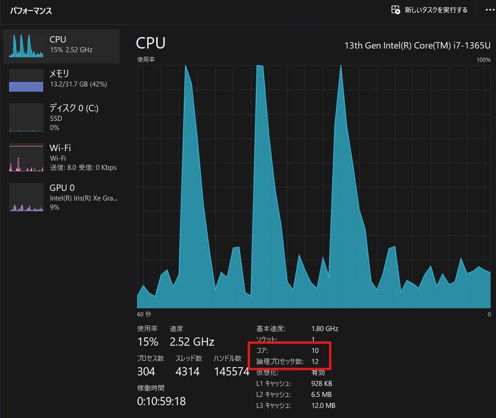

# マルチスレッドとは

- 一つのコンピュータープログラムを実行する際に、アプリケーションのプロセス（タスク）を複数のスレッドに分けて並行処理する流れのこと。
- プログラムの処理の流れが一本のみのシングルスレッドと対比した言葉。

- マルチスレッド機能を用いると、プログラムの実行時に必要に応じて複数の処理の流れを生み出し、異なる処理を並行して進めることができる。スレッドはプロセスのようにOS上で独立した処理単位ではなく、メモリなどの資源を共有して動作することが多い。

- CPUやCPUコアが複数あるコンピュータでは同時に複数のスレッドを実行できるが、単一のプロセッサでもCPUの利用時間を細かく分割して順番に割り当てることでマルチスレッド処理を実現することができる。このようなスレッドの管理をプログラム内部のコードによって行なうものをユーザースレッド（user thread）、OSカーネルが行なうものをカーネルスレッド（kernel thread）という。
  https://www.ntt-west.co.jp/business/glossary/words-00262.html
  https://e-words.jp/w/%E3%83%9E%E3%83%AB%E3%83%81%E3%82%B9%E3%83%AC%E3%83%83%E3%83%89.html

# mFibの実行結果

- 項目45で実施
- 12スレッドが最も速くなる
- 論理プロセッサが12なので、12までは並列で実行できるため速くなる。それ以上増やしてしまうと、並列に実行できないスレッドが溜まってしまうためむしろ遅くなる

- このPCのコア数は10だが、ハイパースレッディングで12まで増やしていると考えられる
  https://www.intel.co.jp/content/www/jp/ja/products/sku/232141/intel-core-i71365u-processor-12m-cache-up-to-5-20-ghz/specifications.html

  | スレッド数 | 実行時間 |
  | ---------- | -------- |
  | 1          | 10.401s  |
  | 2          | 6.604s   |
  | 3          | 7.286s   |
  | 4          | 5.595s   |
  | 5          | 5.260s   |
  | 6          | 5.069s   |
  | 7          | 4.928s   |
  | 8          | 4.831s   |
  | 9          | 4.936s   |
  | 10         | 4.829s   |
  | 11         | 4.726s   |
  | 12         | 4.651s   |
  | 13         | 4.754s   |
  | 14         | 4.861s   |
  | 15         | 4.904s   |

