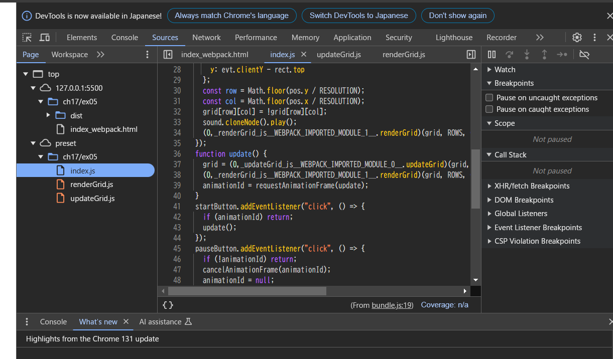
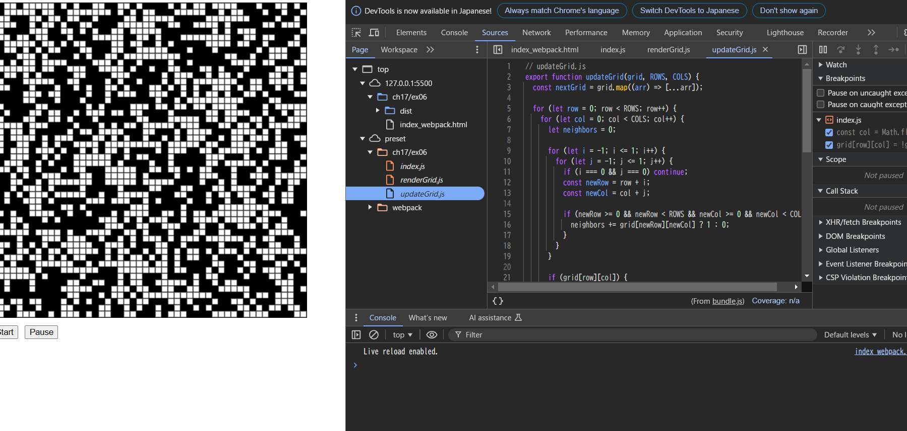
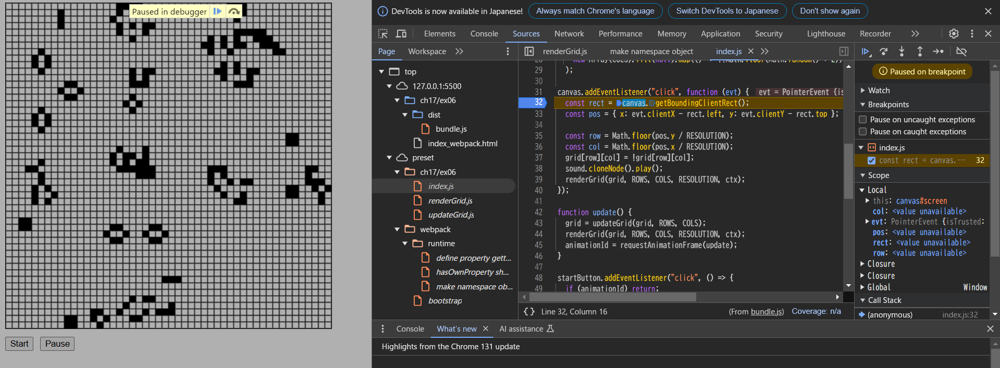
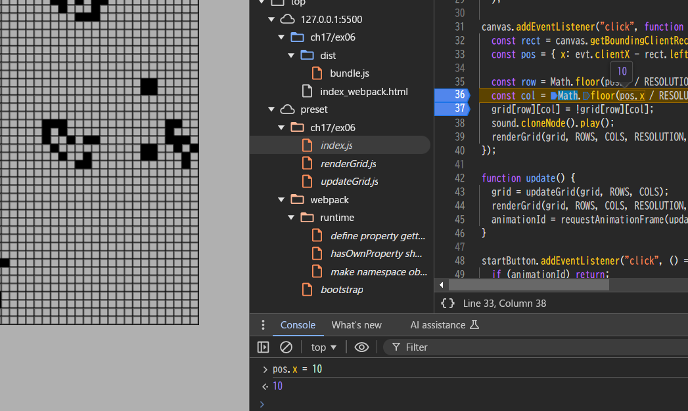
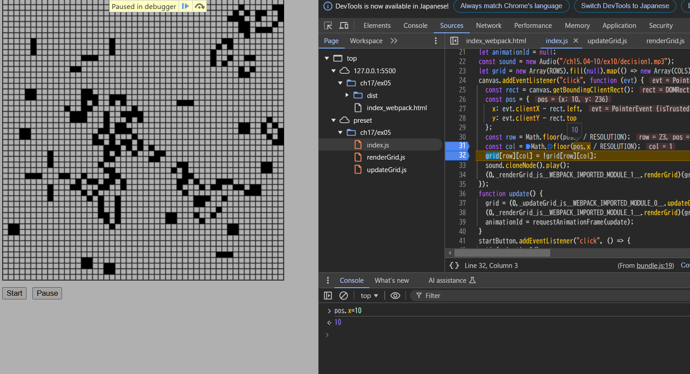

- バンドルしたコードを利用するページをローカルサーバで配信してブラウザから閲覧し、開発者コンソールを利用して以下を確認して結果を記載しなさい。

# 開発者ツールで ソース タブ(Chrome, Edge, Safari) または デバッガー タブ(Firefox) を開き、ソースコードファイルがどのように表示されるかを確認しなさい。

- ex06の方法を使うと、preset以下にWebpack前のコードがそのまま表示される。
- ex05の方法だと、Webpackで加工されたコードが表示される。
- ex05のWebpackをブラウザでソースを表示した際のscript
  
- ex06のWebpackをブラウザでソースを表示した際のscript
  

# バンドルしたコードの実行中に、バンドル前のソースコードファイルに基づいたブレークポイントの設定や変数の値の確認等のデバッグが可能か確認しなさい。

- ブレークポイントで停止した
  
- 変数の書き換えもできた
  

- ex05の方式でも、コードはWebpackされた後のコードだがブレークポイントや変数の値の変更はできた
  
